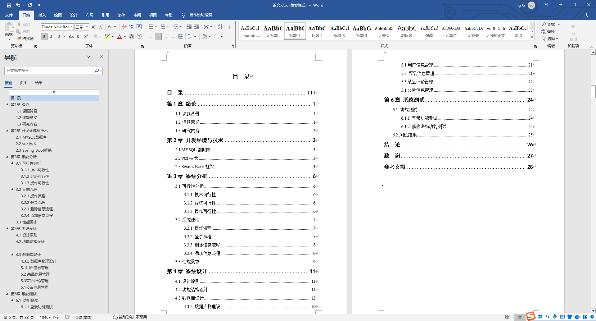
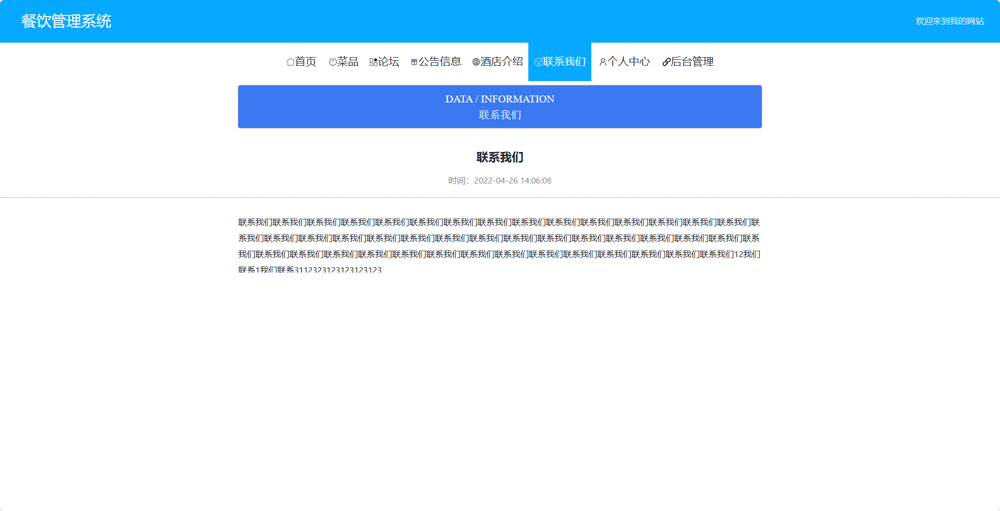

基于SpringBoot的餐饮管理系统（程序+论文）
=
- 完整代码获取地址：从戎源码网 ([https://armycodes.com/](https://armycodes.com/))
- 作者微信：19941326836  QQ：952045282 
- 承接计算机毕业设计、Java毕业设计、Python毕业设计、深度学习、机器学习
- 选题+开题报告+任务书+程序定制+安装调试+论文+答辩ppt 一条龙服务
- 所有选题地址https://github.com/nature924/allProject

一、项目介绍
---
基于Spring Boot框架实现的餐饮管理系统，系统包含三种角色：管理员、员工、用户,系统分为前台和后台两大模块，主要功能如下。
### 前台：
- 菜品：查看和点餐菜品。
- 论坛：用户可以在论坛中交流分享餐饮经验。
- 公告信息：查看餐厅发布的公告信息。
- 酒店介绍：展示餐厅的介绍和特色。
- 联系我们：提供餐厅的联系方式。
- 个人中心：管理个人信息。

### 后台：
- 管理员：
  - 个人中心：管理个人信息。
  - 管理员管理：管理管理员的信息和权限。
  - 菜品管理：创建、修改和删除菜品信息。
  - 基础数据管理：管理系统的基础数据。
  - 论坛管理：管理论坛中的帖子和评论。
  - 供应商管理：管理餐厅的供应商信息。
  - 公告信息管理：发布和管理公告信息。
  - 单页数据管理：管理餐厅网站的单页内容。
  - 用户管理：管理用户的信息和权限。
  - 员工管理：管理餐厅的员工信息。
  - 轮播图信息：管理餐厅网站首页的轮播图信息。

- 员工：
  - 个人中心：管理个人信息。
  - 菜品管理：创建、修改和删除菜品信息。
  - 论坛管理：管理论坛中的帖子和评论。
  - 供应商管理：管理餐厅的供应商信息。
  - 公告信息管理：发布和管理公告信息。

- 用户：
  - 个人中心：管理个人信息。
  - 菜品管理：查看和点餐菜品。
  - 论坛管理：用户可以在论坛中发帖和评论。
  - 公告信息管理：查看餐厅发布的公告信息。

二、项目技术
---
- 编程语言：Java
- 数据库：MySQL
- 项目管理工具：Maven
- 前端技术：VUE、HTML、Jquery、Bootstrap
- 后端技术：Spring、SpringMVC、MyBatis

三、运行环境
---
- 操作系统：Windows、macOS都可以
- JDK版本：JDK1.8以上都可以
- 开发工具：IDEA、Ecplise、Myecplise都可以
- 数据库: MySQL5.7以上都可以
- Tomcat：任意版本都可以
- Maven：任意版本都可以

四、运行截图
---
### 论文截图：

### 程序截图：

